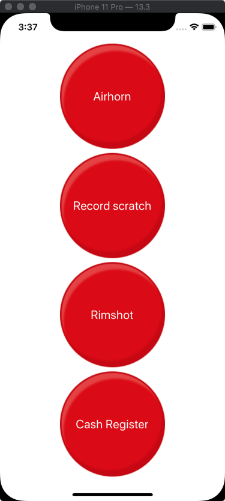

# sboard

a [soundboard](<https://en.wikipedia.org/wiki/Soundboard_(computer_program)>) app built using [Expo](https://expo.io)



## Development setup

Install the `pre-commit` [Git hook](https://git-scm.com/book/en/v2/Customizing-Git-Git-Hooks) by running:

```
ln -s ../../pre-commit.sh .git/hooks/pre-commit
```
